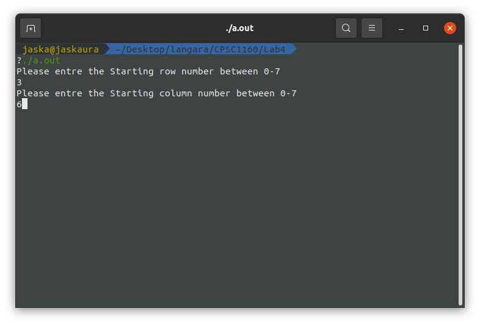
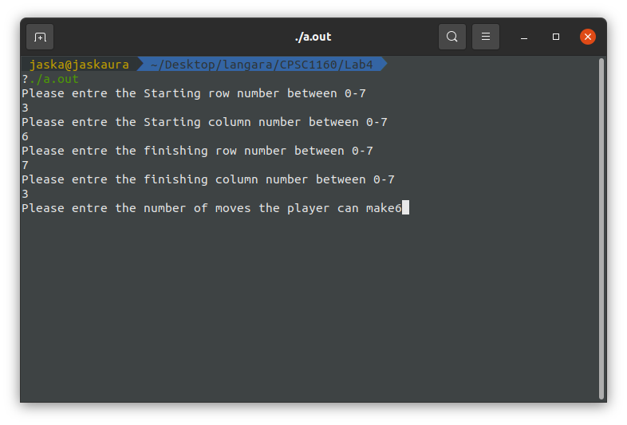
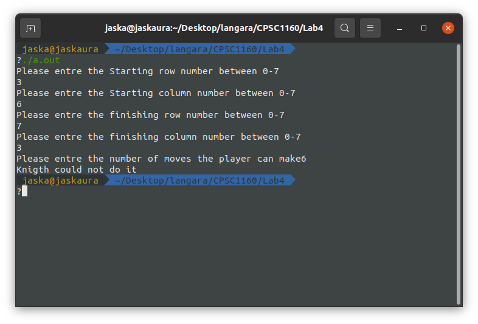
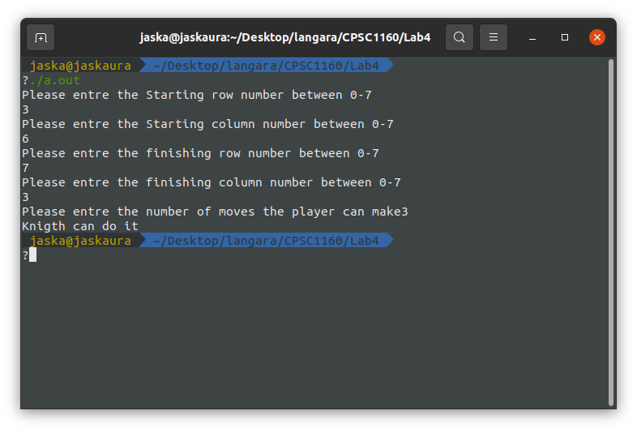

# Knight-s-outing

> Determine if a knight can move from position (c1,r1) to position (c2,r2) in exactly n moves.

## Running Program

OS X & Linux terminal:

```sh
g++ KnightsOuting.cpp
./a.out
```
* Step 1: Entre the starting coordinates (c1,r1)



* Step 2: Entre the ending position (c2,r2)


* Step 3: Entre the number of moves (n)







